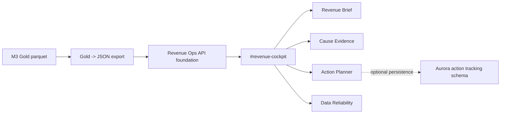

# M5 다음 단계 계획

## 1. M5 한 줄 목표

M5는 새로운 엔지니어링 마일스톤이 아니라, M4 Revenue Cockpit을 발표/포트폴리오/시연 가능한 형태로 정리하는 closure/presentation/polish 단계다.

## 1-1. M5 engineering hardening first, packaging last

M5의 실제 순서는 먼저 엔지니어링 검증 가능성을 정리하고, 그 다음 발표/포트폴리오 패키징으로 넘어간다.

수정된 우선순위:

1. deterministic validation/export hygiene
2. API-connected cockpit mode
3. Revenue Ops API tests
4. validation script
5. AWS readiness doc
6. 이후에 demo guide / screenshot checklist / README / portfolio packaging

## 2. M5 원칙

- 무거운 신규 인프라 작업을 만들지 않는다.
- M3/M4 구현 방향을 바꾸지 않는다.
- 인과관계 확정이나 매출 회복 보장 표현을 추가하지 않는다.
- 기존 Product Ops/TraceOps 화면을 대체하지 않는다.
- M4의 `source -> structure -> evidence -> action -> reliability` narrative를 선명하게 만든다.

## 3. 우선 작업

### 3-1. 최종 발표/포트폴리오 패키징

- M4가 단순 대시보드가 아니라 Gold 레이어를 제품화한 Revenue Ops cockpit임을 설명한다.
- 대상 사용자를 소상공인/매장 운영자로 명확히 둔다.
- "가능성 높은 원인 후보", "함께 관측된 신호", "실행 액션 후보", "데이터 신뢰도" 표현을 일관되게 사용한다.

산출물 후보:

- 프로젝트 소개 1페이지
- M3 -> M4 흐름 요약
- 핵심 화면별 설명
- 기술 스택과 아키텍처 요약

### 3-2. Demo guide 작성

시연 순서를 문서화한다.

권장 흐름:

1. `#revenue-cockpit`으로 진입
2. Revenue Brief에서 12.0% 하락과 함께 관측된 신호 확인
3. Cause Evidence에서 근거 후보 확인
4. Action Planner에서 액션 상태 변경
5. Data Reliability에서 데이터 신뢰도와 한계 확인
6. 기존 Product Ops route가 유지됨을 간단히 확인

산출물 후보:

- `docs/m5_demo_guide_kr.md`
- `docs/m5_interview_talk_track_kr.md`

### 3-3. Screenshot checklist

포트폴리오에 사용할 화면 캡처 기준을 정리한다.

권장 캡처:

- Revenue Brief 한국어/dark
- Revenue Brief 영어/light
- Cause Evidence 상세
- Action Planner 상태 전환 후
- Data Reliability
- `#revenue-cockpit` standalone route 확인

체크 항목:

- Korean text wrapping
- weekly execution plan clipping 없음
- action button visibility
- chart annotation visibility
- right rail 유지
- Light/Dark/System 전환 결과

### 3-4. README cleanup

루트 README 또는 별도 M4 README에서 다음을 정리한다.

- 실행 방법
- validation command
- route/use guide
- M4 artifact 위치
- Gold export 방법
- API endpoint 요약
- 인과관계/매출 회복 보장 아님 caveat

### 3-5. Route/use guide

사용자가 어떤 route를 열어야 하는지 명확히 한다.

포함할 내용:

- Revenue Cockpit: `#revenue-cockpit`
- 기존 Product Ops/TraceOps route와의 차이
- KO/EN switcher
- Light/Dark/System switcher
- Action Planner 상태 흐름

### 3-6. M4 design polish evidence

디자인 polish 결과를 증거화한다.

포함할 내용:

- Claude Design A+ reference 위치
- production React 구현 위치
- decorative chart artifact 제거
- chart height 조정
- causality caution block
- weekly plan clipping fix
- Korean word-break policy

## 4. 아키텍처 다이어그램 또는 Mermaid 요약

M5에서 다음 Mermaid 다이어그램을 추가하면 발표 설명이 쉬워진다.



핵심 설명:

- M3는 source와 structure를 만든다.
- M4는 structure를 evidence, action, reliability로 제품화한다.
- Aurora action tracking은 운영 persistence 준비이며 로컬 데모 필수 조건은 아니다.

## 5. 최종 validation script 검토

M5에서 반복 검증을 줄이기 위해 wrapper script를 선택적으로 추가할 수 있다.

후보 명령:

```bash
npm --prefix apps/web run check
npm --prefix apps/web run build
python3 -m pytest tests/ -q
node --test apps/api/src/**/*.test.js
```

주의:

- 새 스크립트가 불필요하게 pipeline이나 infra를 실행하지 않게 한다.
- 검증 후 `git status --short`를 확인한다.
- Gold export 테스트와 web build가 생성물을 갱신할 수 있다는 점을 문서화한다.

## 6. 선택 작업

### 6-1. Revenue Ops API-specific Node tests

현재 Node 테스트는 M2 legacy compatibility 성격이 강하다.

M5에서 선택적으로 다음을 추가할 수 있다.

- `GET /api/v1/revenue/briefs`
- `GET /api/v1/revenue/briefs/:id`
- `GET /api/v1/revenue/anomalies`
- `GET /api/v1/revenue/anomalies/:id/evidence`
- `GET /api/v1/revenue/actions`
- `PATCH /api/v1/revenue/actions/:id/status`
- invalid status validation
- not found response

단, 이것은 M5의 필수 범위가 아니라 발표 안정성을 높이는 선택 작업이다.

### 6-2. M2 legacy compatibility boundary 정리

기존 M2 테스트가 무엇을 보장하고, M4 Revenue Ops API는 무엇을 별도로 보장해야 하는지 짧게 정리한다.

목적:

- 기존 API 안전성 회귀 방지
- Revenue Ops API 전용 검증 공백 인식
- 발표 시 "기존 시스템을 깨지 않았다"는 설명 근거 확보

## 7. 인터뷰/발표에서 보여줄 이야기

권장 narrative:

1. 문제: 소상공인은 매출 하락을 보아도 무엇을 확인하고 어떤 액션을 검토할지 알기 어렵다.
2. M3: 원천 데이터를 medallion 구조로 정리하고 Gold 레이어를 만들었다.
3. M4: Gold를 merchant-facing Revenue Ops Cockpit으로 제품화했다.
4. 핵심: 원인을 확정하지 않고, 함께 관측된 신호를 근거로 가능성 높은 원인 후보를 보여준다.
5. 액션: 실행 액션 후보를 제시하고 상태 흐름으로 추적한다.
6. 신뢰도: 데이터 커버리지와 한계를 함께 보여준다.
7. 안전한 주장: 매출 회복을 보장하지 않고, 의사결정 지원에 집중한다.

## 8. M5 완료 기준

- demo guide 작성
- screenshot checklist 작성
- README 또는 route/use guide 정리
- architecture diagram 또는 Mermaid summary 추가
- final validation 재실행 및 결과 기록
- presentation/interview narrative 정리
- 필요 시 Revenue Ops API-specific Node tests 추가

M5 완료 후에는 새 기능보다 최종 제출/발표 품질을 기준으로 판단한다.
